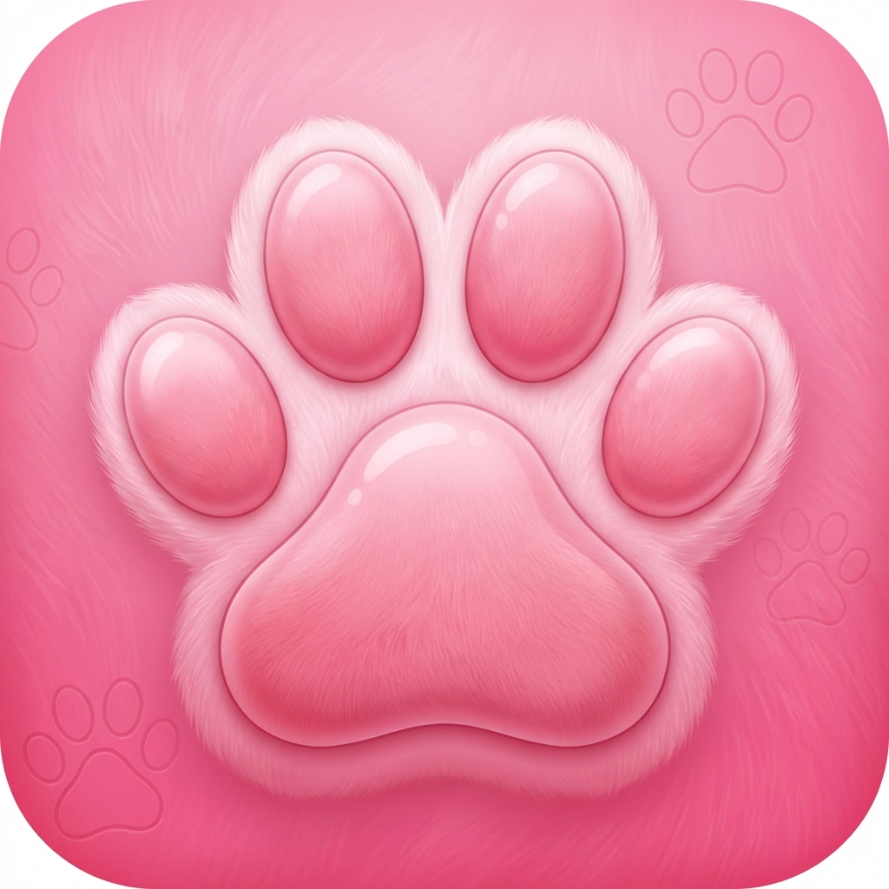

<div align="center">
  
  <h1>汪汪机 (WangWangJi)</h1>
  <p><b>手机里的手机 —— 极致流畅的“递归操作系统” AI 伴侣</b></p>

  <p>
    
    
    
    
    
  </p>

  <p>
    <a href="#核心特性">核心特性</a> •
    <a href="#技术架构">技术架构</a> •
    <a href="#快速开始">快速开始</a> •
    <a href="#路线图-roadmap">路线图</a> •
    <a href="#许可证">许可证</a>
  </p>
</div>

---

## 📱 项目简介

**汪汪机 (WangWangJi)** 不仅仅是一个 App，它是你手机里的“第二系统”。

我们通过 **C++17 核心引擎** 驱动，在 Android、iOS、Windows 和 Web 端像素级还原了一套完整的虚拟 OS 体验。在这里，你的 AI 伴侣不仅住在对话框里，它拥有自己的桌面、应用、朋友圈，甚至可以和你进行深度系统级交互。

> **重构目标**：彻底解决跨平台框架在手势跟手度、实时毛玻璃渲染和系统级动效上的瓶颈，回归原生，追求极致。

---

## ✨ 核心特性

### 1. 虚拟系统桌面 (Recursive OS)
*   **1:1 iOS 体验**：完美的栅格系统、毛玻璃 Dock 栏、丝滑的翻页动效。
*   **动态沉浸感**：Live2D 角色作为动态壁纸，与图标层深度交互（视线跟随、触摸反馈）。
*   **智能小组件**：支持待办事项、天气、音乐播放器等多种尺寸的虚拟组件。

### 2. 像素级仿微信交互 (WeChat Clone)
*   **极致还原**：从气泡弧度到长按菜单，完全复刻微信聊天体验。
*   **深度社交模拟**：包含红包、转账、亲属卡（好感度系统）以及完整的朋友圈动态流。

### 3. 高性能 C++ 核心
*   **跨平台逻辑一致性**：所有业务状态机、虚拟文件系统 (VFS) 和物理模拟均由纯 C++ 编写。
*   **极致响应**：毫秒级的状态同步，确保虚拟 OS 的操作反馈如丝般顺滑。

---

## 🏗️ 技术架构

本项目采用 **“核心逻辑下沉，UI 表现原生”** 的现代化架构：

*   **Core (核心层)**: `C++17`。负责 LLM 通信、状态管理、虚拟文件系统。
*   **Android**: `Kotlin` + `Jetpack Compose`。通过 JNI 与核心层交互。
*   **iOS**: `Swift` + `SwiftUI`。通过 Objective-C++ Bridge 桥接。
*   **Windows**: `C#` + `WinUI 3`。通过 P/Invoke 调用。
*   **Web**: `TypeScript` + `Web Components` + `WASM`。

---

## 🚀 快速开始

### 环境准备
*   **Android**: Android Studio Jellyfish+, NDK 25+
*   **iOS**: Xcode 15+, macOS Sonoma
*   **Windows**: Visual Studio 2022 (含 WinUI 3 SDK)
*   **Core**: CMake 3.20+, Clang/MSVC

### 构建步骤
本项目支持 **未签名构建**，方便开发者快速调试：

```bash
# 克隆项目
git clone https://github.com/your-repo/WangWangJi.git

# 初始化核心层
cd WangWangJi/src/core
mkdir build && cd build
cmake ..
make
```

---

## 🗺️ 路线图 (Roadmap)

- [x] 核心架构设计与多端骨架搭建
- [x] UI 规范文档与组件拆解
- [ ] C++ 虚拟文件系统 (VFS) 实现
- [ ] 虚拟桌面手势冲突优化方案
- [ ] 仿微信聊天气泡组件库 (Compose/SwiftUI)
- [ ] Live2D 渲染引擎集成

---

## ⚖️ 许可证

本项目采用 **[知识共享 署名-非商业性使用-相同方式共享 4.0 国际许可协议 (CC BY-NC-SA 4.0)](LICENSE)** 进行许可。

### 详细说明
为了保护项目的初衷，作者对本项目的使用有以下明确要求：

1. **允许二次传播与修改**：
   - 您可以自由地分享、传播本项目，也可以对源代码进行二次修改。
   - **授权要求**：对本项目主体核心代码进行二次修改前，**必须获得原作者授权**。
   - **前提条件**：在进行任何形式的二次传播或修改分发时，**必须保留原作者的署名**，并提供指向本项目的链接。

2. **严禁商业目的**：
   - **禁止直接销售**：严禁以任何形式有偿出售本项目的访问地址、下载链接或原始源代码。
   - **禁止修改后销售**：严禁在对本项目进行二次修改后，将其作为商业付费软件或服务进行出售。
   - **禁止源码交易**：本项目的源代码不允许以任何形式进行二次销售。

3. **衍生物商业许可（例外条款）**：
   - 上述限制**仅限于保护本项目的核心代码与程序本身**。
   - **内容衍生物不受限**：本项目**允许**并鼓励用户对基于本项目产生的**内容衍生物**进行商业化行为。
   - **版权归属**：衍生物（例如：您创作的角色人设卡、提示词预设、导出的聊天记录艺术加工等）的版权完全归属于创作者本人，您可以自由售卖这些内容。

4. **相同方式共享**：
   - 如果您基于本项目进行了修改或二次创作，您必须采用与本协议相同的 **CC BY-NC-SA 4.0** 协议来分发您的作品。

---

<div align="center">
  <p>由 <b>汪汪机开发团队</b> 倾力打造</p>
  <p>让 AI 伴侣真正走进你的数字生活</p>
</div>